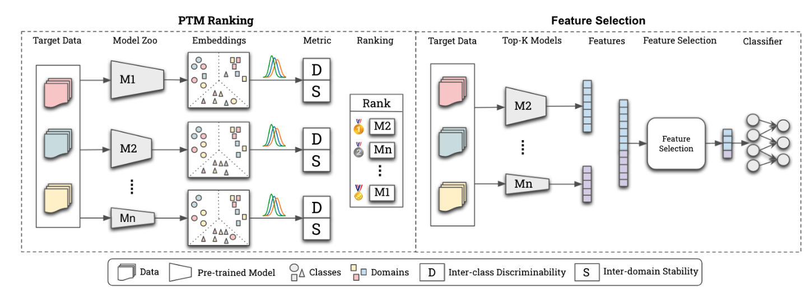

# 解决了什么问题？
- 提出了可以将model zoo应用在OoD任务中的一种方法：ZooD，一种 PTM 排名和特征选择集成的范例
- # 怎么解决？
- # 相较于原有方法有何提升？
- 
- ## PTM Ranking
- PTM Ranking分别将不同领域的目标数据传入到所有模型中，得到他们的discriminability（可区分性）和stability（稳定性），通过这两个性能指标对模型进行排序，最终采用排名最高的模型
- ## Feature Selection
- Feature Selection将不同领域的目标数据传入到前K优秀的模型中，得到K个特征，将特征组合起来，通过特征选择器将特征进行聚合和去噪，直观地理解就是Feature Selection操作并不是选择某一模型，而是综合考虑了所有模型的特征提取结果